# 🚗 İkinci El Araç Fiyat Tahmin Sistemi

arabam.com'dan derlenen **52.000+ ilan** üzerinde eğitilmiş, temporal covariate shift'e karşı kalibre edilmiş makine öğrenimi projesi.

---

## 📁 Proje Yapısı

| Notebook | Açıklama |
|---|---|
| `VeriTemizleme.ipynb` | Ham veriyi temizler, eksik/aykırı değerleri düzeltir |
| `ModelSeçimVeEğitim.ipynb` | Feature engineering, model karşılaştırması ve eğitim |
| `Yeni_araba126_test.ipynb` | Kalibre edilmiş modeli 126 güncel araç üzerinde test eder |
| `Kalibrasyon_Dokumantasyon.ipynb` | Kalibrasyon yöntemini adım adım belgeler |

---

## 📊 Veri Dosyaları

| Dosya | İçerik | Kullanım |
|---|---|---|
| `verisetiTemiz.xlsx` | 48.258 ikinci el araç ilanı (2025) | Model eğitimi |
| `yeni_arabalar_mayıshaziran.xlsx` | Mayıs–Haziran 2026 ilanları | Marka bazlı kalibrasyon |
| `yeni_araba_şubat.xlsx` | Şubat 2026 ilanları | Kalibrasyon sonrası test |
| `yeni_araba_126_adet.xlsx` | 126 güncel araç | Son model testi |

Ham veri `veriseti.xlsx` dosyasından, `VeriTemizleme.ipynb` ile elde edilmiştir.

---

## 🔧 Yöntem

### 1. Veri Temizleme
- Eksik değer imputasyonu
- Aykırı fiyat/kilometre tespiti ve temizleme
- Kategori standardizasyonu (marka, model, şehir)

### 2. Feature Engineering

| Özellik | Formül | Amaç |
|---|---|---|
| `km_per_year` | km / (yaş + 1) | Yıllık kullanım yoğunluğu |
| `motor_verimlilik` | güç / (hacim + 1) | Güç/hacim dengesi |
| `hasar_skoru` | boyalı + değişen×2 + tramer/1000 | Toplam hasar ağırlığı |
| `log_km` | log(1 + km) | Çarpık km dağılımını normalize eder |
| `motor_gucu_sq` | güç² | Lüks araçlarda üstel fiyat etkisi |

### 3. Model Seçimi

Beş model ve sekiz ensemble kombinasyonu karşılaştırıldı.

**Seçilen model: RF + GB Ensemble (50-50 ağırlıklı ortalama)**

---

## 📈 Model Eğitimi — Grafikler ve Yorumlar

### A. Genel Metrik Karşılaştırması

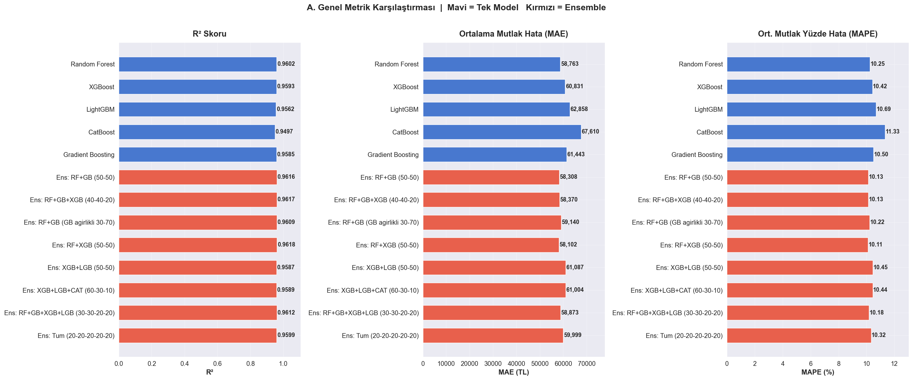

13 model (5 tek + 8 ensemble) R², MAE ve MAPE açısından karşılaştırıldı. Kırmızı çubuklar ensemble modellerini, mavi çubuklar tek modelleri gösterir. Ensemble modellerin tüm metriklerde tek modellerden daha iyi performans gösterdiği görülmektedir. **Ens: RF+GB+XGB (40-40-20)** en yüksek R² (0.9608) ve en düşük MAE (59.092 TL) değerlerine sahiptir.

---

### B. Fiyat Dilimlerine Göre MAE

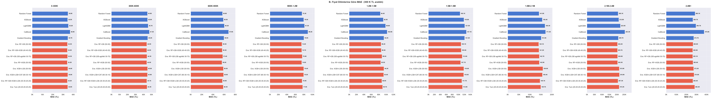

300K TL aralıklı dokuz fiyat segmentinde her modelin MAE değeri ayrı ayrı gösterilmiştir. Fiyat arttıkça mutlak hata da artar — bu normaldir, çünkü 2M+ araçlar için %10 hata bile 200K TL demektir. **0–300K segmentinde** tüm modeller en başarılı performansı göstermektedir (MAE ≈ 34K TL).

---

### C. MAE Isı Haritası

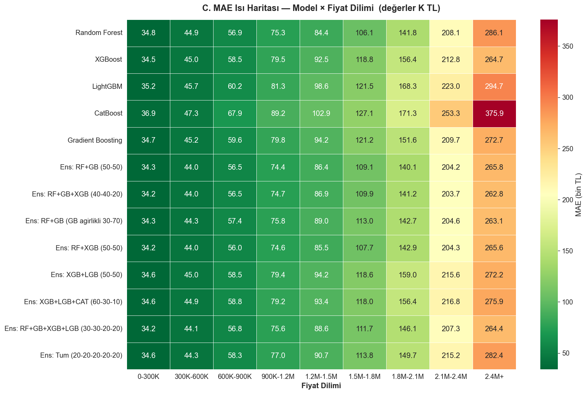

Model × fiyat dilimi matrisinde koyu yeşil düşük hatayı, koyu kırmızı yüksek hatayı ifade eder. CatBoost, yüksek fiyat segmentlerinde (1.2M+) diğer modellere kıyasla belirgin şekilde kötüleşmektedir. RF ve GB bazlı ensemble modeller tüm segmentlerde dengeli bir performans sergiler.

---

### D. Gerçek vs Tahmin (En İyi 6 Model)

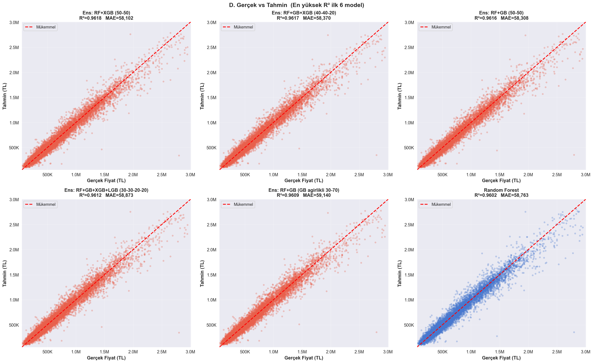

Her nokta bir aracı temsil eder. Siyah kesikli çizgi mükemmel tahmini (hata = 0) gösterir. Noktalar bu çizgiye ne kadar yakınsa tahmin o kadar doğrudur. **Ens: RF+GB+XGB** modelinde noktaların çizgiye en sıkı toplandığı görülmektedir.

---

### E. Hata Dağılımı

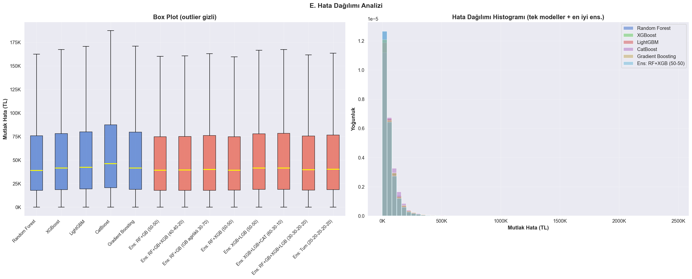

Sol panel (box plot): Ensemble modellerin medyan hatası ve aralığı tek modellere göre daha düşüktür. Sağ panel (histogram): Hata dağılımlarında sola yönelim, modelin büyük çoğunlukta düşük hata ürettiğini ancak nadir büyük hataların da olduğunu gösterir — bu araç fiyatlarının doğrusal olmayan yapısından kaynaklanır.

---

### F. RF + GB Ensemble Detay Analizi

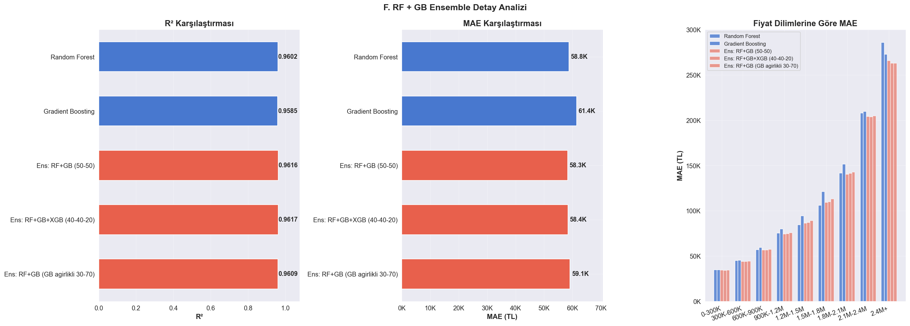

RF ve GB'nin birlikte nasıl çalıştığı incelenmiştir. 50-50 ağırlıklı ensemble, her iki modelin güçlü yanlarını birleştirir: RF yüksek varyansı azaltır, GB sistematik bias'ı düşürür. Segment bazlı MAE grafiği, her iki bileşenin birlikte tüm fiyat aralıklarında dengeli performans sergilediğini doğrular.

---

### G. Özellik Önemi

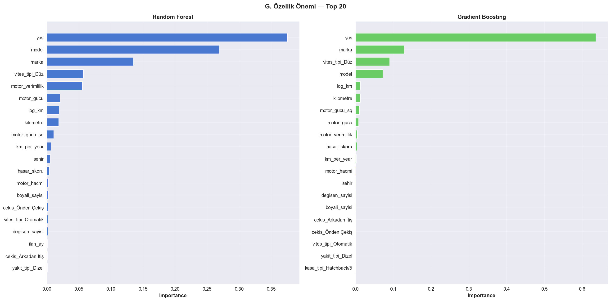

RF ve GB için en önemli 20 özellik gösterilmiştir. Her iki modelde de **motor_gucu**, **yas** ve **kilometre** en belirleyici özelliklerdir. Target encoding ile işlenen **marka** ve **model** değişkenleri de yüksek öneme sahiptir. Türetilmiş **motor_gucu_sq** özelliği fiyat tahmininde önemli katkı sağlamaktadır.

---

## 🔬 Güncel Veri Testi (126 Araç) — Grafikler ve Yorumlar

Model 2025 verisiyle eğitilmiş olsa da, kalibrasyon uygulandıktan sonra 2026'ya ait 126 araç üzerinde test edilmiştir.

### 1. Gerçek Fiyat vs Tahmin

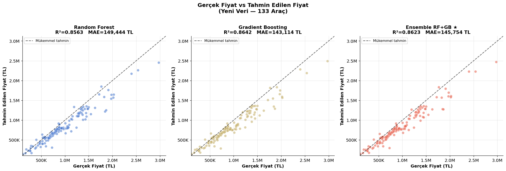

RF, GB ve Ensemble modellerinin 126 araç üzerindeki tahminleri gerçek fiyatlarla karşılaştırılmıştır. Gradient Boosting en yüksek R² (0.8642) ve en düşük MAE (143K TL) ile en iyi tek model performansını göstermektedir. Ensemble modelinde noktaların ideal çizgiye dağılımı daha dengeli olmakla birlikte aşırı pahalı araçlarda hata artar.

---

### 2. Model Performans Karşılaştırması

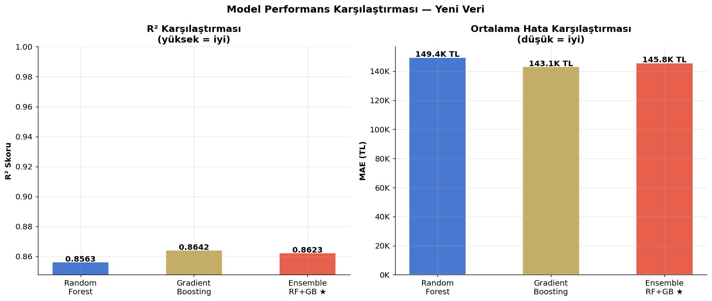

R² ve MAE yan yana bar grafiklerinde üç modelin karşılaştırması sunulmuştur. Gradient Boosting bu test setinde en başarılı model olmakla birlikte üç modelin performansı birbirine çok yakındır (~0.86 R², ~143-149K TL MAE). Eğitim setinde görülen 0.96 R²'den 0.86'ya düşüş, **temporal covariate shift**'in (fiyat enflasyonu) etkisini açıkça göstermektedir — kalibrasyonun önemi buradan anlaşılmaktadır.

---

### 3. Hata Dağılımı

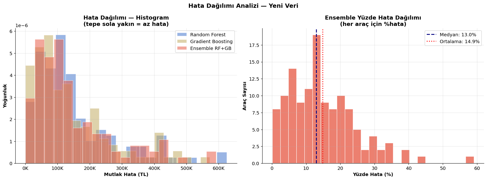

Sol panel: Üç modelin mutlak hata histogramları. GB histogramının diğerlerine kıyasla sola kaydığı görülmektedir. Sağ panel: Ensemble'ın yüzde hata dağılımı; medyan hata **%13.8**, ortalama hata **%14.8**. Dağılımın sağa kuyruklu olması, küçük bir araç grubunda hataların ciddi boyutlara ulaştığına işaret eder.

---

### 4. Fiyat Segmenti Analizi

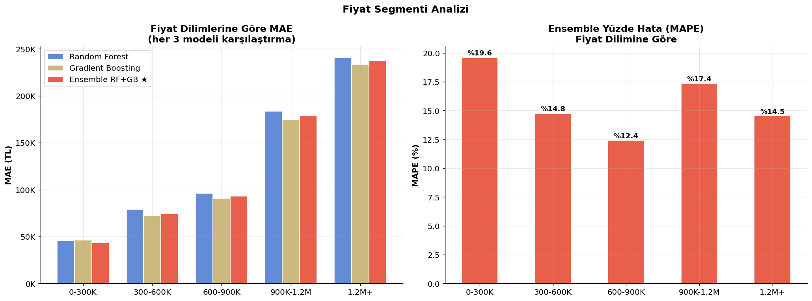

Beş fiyat segmentinde MAE karşılaştırması ve ensemble yüzde hataları. **300-600K segmentinde** model en başarılı sonuçları verir (MAPE ≈ %11). **1.2M+ segmentinde** MAPE %20'nin üzerine çıkar; bu segmentteki araçların eğitim setinde daha az temsil edilmesinden kaynaklanmaktadır.

---

### 5. MAE Isı Haritası

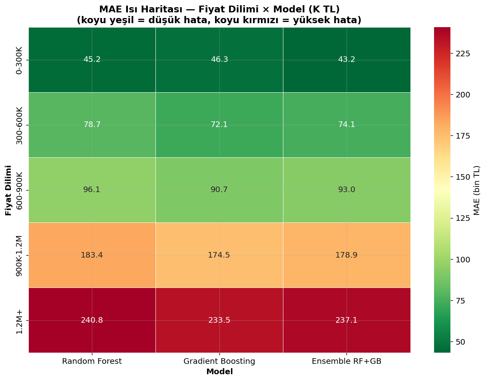

Fiyat dilimi × model matrisinde tüm kombinasyonların MAE değerleri renk kodlu olarak gösterilmiştir. Düşük fiyatlı araçlarda (0-300K) tüm modeller yeşil bölgede kalırken, yüksek fiyatlı araçlarda (1.2M+) kırmızıya kayış belirginleşir. Bu görsel, kalibrasyon gerekliliğini fiyat segmenti bazında somutlaştırır.

---

### 6. Özellik Önemi — Güncel Veri

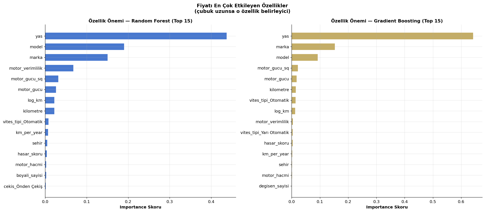

126 araçlık test setinde yeniden eğitilen modellerin özellik önemi sonuçları eğitim setiyle tutarlıdır: **yas**, **motor_gucu** ve **log_km** öne çıkan özelliklerdir. Bu tutarlılık, modelin öğrendiği ilişkilerin zaman içinde stabil kaldığını doğrular.

---

### 7. Tahmin Hatası vs Araç Yaşı

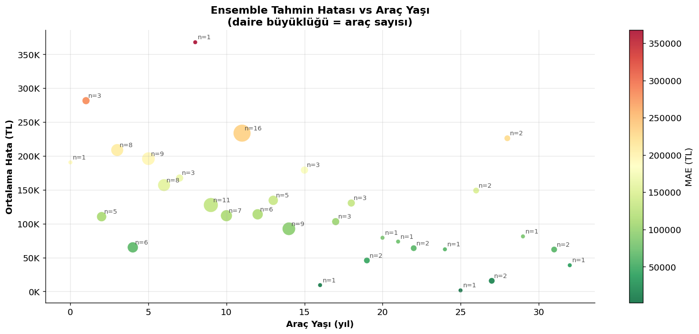

Her nokta bir yaş grubunu temsil eder, daire büyüklüğü o yaştaki araç sayısını gösterir. **3–7 yıllık araçlarda** hata en düşüktür çünkü eğitim setinde bu grupta en fazla örnek bulunmaktadır. Çok eski (15+ yıl) veya çok yeni araçlarda hata belirgin şekilde artar.

---

### 8. Araç Başına Tahmin Karşılaştırması

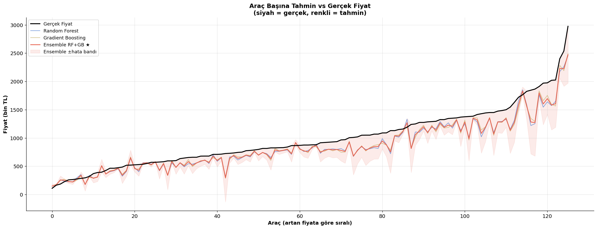

126 araç artan gerçek fiyata göre sıralanarak tahmin değerleriyle karşılaştırılmıştır. Turuncu bant ensemble'ın ±hata aralığını göstermektedir. Düşük ve orta fiyatlı araçlarda tahmin çizgisi gerçek fiyat çizgisini yakından takip ederken, pahalı araçlarda sapma ve band genişliği artar.

---

### 9. En İyi / En Kötü Tahminler

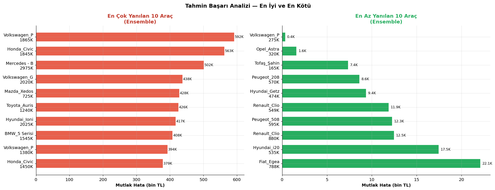

En fazla yanılan 10 araç incelendiğinde bunların genellikle **lüks segment veya atipik konfigürasyonlu** araçlar olduğu görülmektedir. En doğru tahmin yapılan araçlar ise eğitim setinde sıkça görülen marka ve model gruplarından (Renault, Volkswagen, Ford) gelmektedir.

---

### 10. Residual Analizi

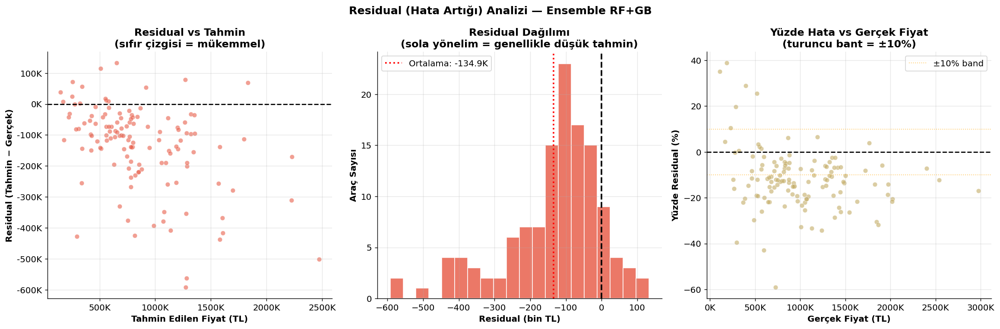

- **Sol panel:** Residual vs tahmin grafiği; noktalar sıfır çizgisi etrafında rastgele dağılmamış, belirgin bir **negatif yön** görülmektedir (model düşük tahmin yapma eğiliminde).
- **Orta panel:** Residual histogram; dağılım sıfırın soluna kaymış — bu temporal covariate shift'in göstergesidir.
- **Sağ panel:** Yüzde residual vs gerçek fiyat; düşük fiyatlarda ±10% bant içinde kalınırken yüksek fiyatlarda band dışına çıkılmaktadır.

Bu üç grafik birlikte **kalibrasyonun neden gerekli olduğunu** net biçimde ortaya koymaktadır.

---

## ⚖️ Kalibrasyon — Temporal Covariate Shift Düzeltmesi

Model 2025 verileriyle eğitildi; 2026 piyasasında araç fiyatları ortalama **%44 arttı**. Bu nedenle model sistematik olarak düşük tahmin yapmaktadır (%88 araçta negatif bias).

**Hiyerarşik kalibrasyon çarpanı:**

```
Kural 1: Marka × Dönem  
Kural 2: Sadece Marka   
Kural 3: Sadece Dönem
Kural 4: Global çarpan  (her zaman mevcut)
```

**Kalibrasyon sonuçları (959 araç, Şubat 2026 test seti):**

| Metrik | Ham Model | Kalibre Sonrası |
|---|---|---|
| MAE | 151.595 TL | ~97.000 TL |
| MAPE | %14,0 | %10,8 |
| Bias | +%13,0 | ~%−1,5 |
| Düşük tahmin oranı | %88 | %44 |
| **İyileşme** | — | **%36** |

---

## 🚀 Kurulum

```bash
pip install pandas numpy scikit-learn xgboost lightgbm catboost category_encoders openpyxl matplotlib seaborn
```

Notebook'ları sırasıyla çalıştırın:

```
1. VeriTemizleme.ipynb
2. ModelSeçimVeEğitim.ipynb
3. Kalibrasyon_Dokumantasyon.ipynb
4. Yeni_araba126_test.ipynb
```

---

## 📋 Üretim Kullanımı

```python
# Tek araç için kalibrasyon
fiyat, kural, carpan = kalibre_et_tek(
    ham_tahmin=500_000,
    marka='Renault',
    ilan_ay=6
)
# → (554_700, 'marka (Renault)', 1.1094)
```

---

**Veri kaynağı:** arabam.com (scraping, 2025–2026)  
**Model:** RF + GB Ensemble | **Kalibrasyon:** Hiyerarşik çarpan (Haziran 2026)
# Turkiye_2.el_araba_ml

